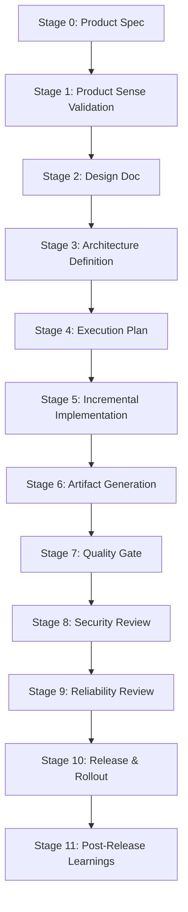

# Agent Instructions & Collaboration Guidelines (AGENTS.md)

Welcome, AI Agent! You are pair-programming with the user in a workspace structured around a rigorous **Idea to Production (I2P) Governance Model**. Every non-trivial change, new feature, or refactor must follow this lifecycle. Do not skip stages or write code before design is signed off.

---

## 1. The Golden Path Lifecycle

Your workflow follows these explicit stages:



---

## 2. Your Rules of Engagement

### 1. Document Before Coding
*   **Rule:** Never write code or create PRs for new features without an approved Product Spec and Design Doc.
*   **Action:** If the user asks for a feature, first draft the Product Spec (`docs/product-specs/<feature>.md`) and Design Doc (`docs/design-docs/<feature>/index.md`).

### 2. Single Source of Truth
*   **Rule:** Technical decisions, product requirements, and execution statuses must be committed to the repository, not left in chat logs.
*   **Action:** Keep `PLANS.md`, `ARCHITECTURE.md`, and the active execution plan (`docs/exec-plans/active/<feature>.md`) updated.

### 3. Maintain Quality Gates
*   **Rule:** Every pull request/code modification must maintain or improve the metrics in `QUALITY_SCORE.md`.
*   **Action:** Write unit tests alongside logic. Verify linting and type checks pass.

### 4. Continuous Security & Reliability Alignment
*   **Rule:** Verify your changes against the guidelines in `SECURITY.md` and `RELIABILITY.md`.
*   **Action:** Run OWASP checks, input validation, verify rollback commands, and update SLO/SLA configurations if API profiles change.

---

## 3. How to Bootstrap a New Idea
Use the local initializer script to set up the necessary files:
```bash
./scripts/init-idea.sh "your-feature-name"
```
This generates the initial draft files and registers the idea in `PLANS.md`.
