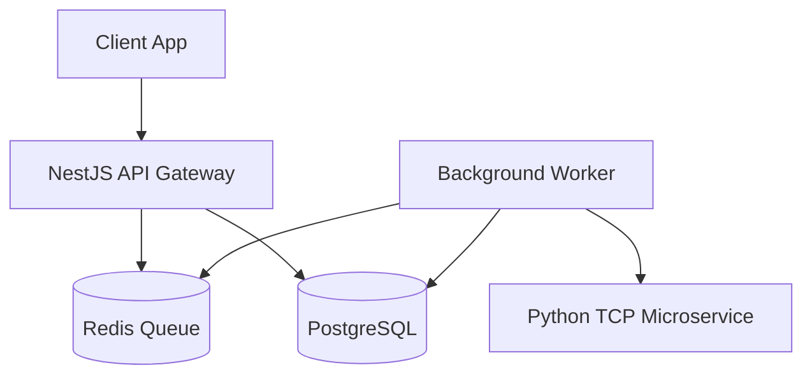

# System Architecture (ARCHITECTURE.md)

## 1. High-Level Architecture

*Describe the system components, boundaries, and communication paths. Use Mermaid diagrams to visualize interactions.*

---

## 2. Components & Boundaries

*   **API Gateway**: Receives external traffic, handles authentication/authorization, validates schemas, and enqueues background processing jobs.
*   **Background Worker**: Processes compute-heavy validation rules, communicates with Python NLP engines, updates state, and dispatches webhooks.
*   **Python TCP Service**: Light NLP engine scanning input text for PII detection.
*   **PostgreSQL**: Ledger database holding cryptographic audit chains.
*   **Redis**: High-throughput queue provider.

---

## 3. Technology Stack & Observability

*   **Frameworks**: NestJS (Backend), Next.js (Dashboard), Python asyncio (NLP).
*   **Databases**: PostgreSQL (Prisma ORM), Redis (ioredis client).
*   **Telemetry**: OpenTelemetry tracing and Prometheus metrics.

---

## 4. Architectural Decision Records (ADRs)

Use this section to record major technical decisions, alternatives considered, and design trade-offs.

### [ADR-001] Async Job Verification via Redis Queue
*   **Status**: Accepted
*   **Context**: Incoming requests to redact and evaluate policies can be compute-heavy (Presidio NLP + complex rules). Direct HTTP request-response block cycles would degrade latency.
*   **Decision**: Run verification asynchronously. The gateway returns `202 Accepted` immediately upon writing to PostgreSQL and enqueuing to Redis. Workers consume via `BRPOP`.
*   **Consequences**:
    *   *Pros*: Sub-millisecond gateway response; robust rate-limiting and retry capabilities.
    *   *Cons*: Clients must poll or support webhooks to receive verdicts.
