# Domain Sentinel Report Technical Design

This document details the technical design and architecture for the **Domain Sentinel Report** validation gateway and audit logging system.

---

## 1. Flow & User Journeys

The gateway intercepts agent tool invocations, processes them asynchronously, and generates a tamper-evident audit record (Domain Sentinel Report).

```mermaid
sequenceDiagram
  autonumber
  actor Agent as Client Agent/Application
  participant GW as NestJS Gateway API
  participant DB as PostgreSQL Ledger
  participant RD as Redis Queue
  participant Worker as Background Worker
  participant PII as Python PII TCP Service

  Agent->>GW: POST /api/v1/intercept
  Note over GW: Validate request structure (Zod)
  GW->>DB: Insert initial AuditRecord (PENDING)
  GW->>RD: Enqueue Job ID (LPUSH)
  GW-->>Agent: Return 202 Accepted (Request ID + Polling URL)

  Note over Worker, RD: Worker polls Redis via BRPOP
  RD-->>Worker: Dequeue Job ID
  Worker->>DB: Fetch PENDING audit record & raw parameters
  
  Note over Worker, PII: TCP Connection established (Port 50051)
  Worker->>PII: Send raw request parameters (Newline-terminated JSON)
  PII->>PII: Scan & Mask PII (Presidio / spaCy NLP)
  PII-->>Worker: Return redacted parameters
  Note over Worker, PII: TCP Socket Closed

  Worker->>Worker: Evaluate Compliance Rule Engine (Reg F, QM, OFAC)
  Worker->>Worker: Calculate riskScore and decide verdict (APPROVE, BLOCK, ESCALATE)
  
  Worker->>DB: Update AuditRecord with redacted params, verdict, and SHA-256 chain hash
  
  opt Verdict is ESCALATE
    Worker->>DB: Create human review ticket (ReviewTicket PENDING)
  end
  
  Agent->>GW: GET /api/v1/status/:requestId (Polling)
  GW->>DB: Fetch processed AuditRecord
  GW-->>Agent: Return 200 OK (Domain Sentinel Report: Status, Verdict, Redacted Parameters)
```



---

## 2. API Contract

### A. Intercept Tool Call
*   **Endpoint**: `POST /api/v1/intercept`
*   **Request Body (Zod)**:
    ```typescript
    const RequestMetadataSchema = z.object({
      sourceIp: z.string().default('127.0.0.1'),
      userAgent: z.string().default('unknown'),
      correlationId: z.string(),
      traceId: z.string(),
      environment: z.enum(['development', 'staging', 'production']),
      priority: z.enum(['LOW', 'NORMAL', 'HIGH', 'CRITICAL']),
    });

    const RawRequestSchema = z.object({
      id: z.string().uuid(),
      agentId: z.string().min(1),
      sessionId: z.string().min(1),
      timestamp: z.date(),
      tool: z.string().min(1),
      action: z.string().min(1),
      parameters: z.record(z.string(), z.any()),
      metadata: RequestMetadataSchema.optional(),
      signature: z.string().optional(),
    });
    ```
*   **Response (202 Accepted)**:
    ```json
    {
      "requestId": "d9b936a7-0e6d-4950-a92c-0e7855018672",
      "status": "PENDING",
      "message": "Request successfully received and queued for compliance checks.",
      "pollingUrl": "/api/v1/status/d9b936a7-0e6d-4950-a92c-0e7855018672"
    }
    ```

### B. Query Intercept Status (Report Retrieval)
*   **Endpoint**: `GET /api/v1/status/:requestId`
*   **Response (200 OK - COMPLETED)**:
    ```json
    {
      "requestId": "d9b936a7-0e6d-4950-a92c-0e7855018672",
      "status": "REJECTED",
      "verdict": "BLOCK",
      "timestamp": "2026-08-13T12:00:05.123Z",
      "reasoning": "Request blocked: Reg F contact attempts limit of 7 exceeded. Actual: 7 contact attempts.",
      "riskScore": 0.9,
      "validationSummary": {
        "totalChecks": 5,
        "passedChecks": 4,
        "failedChecks": 1
      },
      "rulesTriggered": ["REG_F_FREQUENCY"],
      "auditHash": "e3b0c44298fc1c149afbf4c8996fb92427ae41e4649b934ca495991b7852b855",
      "redactedParameters": {
        "customerId": "cust_555",
        "phone": "XXX-XXX-9999",
        "localTime": "14:30"
      }
    }
    ```

---

## 3. Data Model & State Machine

### Prisma Schema Definitions

Every intercept decision updates the ledger chain using cryptographic linking:

```prisma
model AuditRecord {
  id               String        @id @default(uuid())
  requestId        String        @unique
  receivedAt       DateTime      @default(now())
  completedAt      DateTime?
  
  // Intercept Identifiers
  agentId          String
  sessionId        String
  toolName         String
  actionName       String
  
  // Payloads
  rawRequest       Json          // Original unredacted input parameters
  parsedRequest    Json?         // Masked/Redacted parameters
  validationResult Json?         // Compliance rule evaluations (checks & failures)
  decisionRecord   Json?         // Risk score analysis and final verdict
  executionResult  Json?         // Output from tool call (if approved & executed)
  
  // Ledger Hash Linkage
  chainIndex       Int           @unique
  previousHash     String
  hash             String
  
  reviewTicket     ReviewTicket?
}

model ReviewTicket {
  id             String       @id @default(uuid())
  ticketNumber   String       @unique
  auditRecordId  String       @unique
  auditRecord    AuditRecord  @relation(fields: [auditRecordId], references: [id])
  
  status         ReviewStatus @default(PENDING)
  priority       String       @default("NORMAL")
  escalatedAt    DateTime     @default(now())
  resolvedAt     DateTime?
  reviewerId     String?
  notes          String?
}

enum ReviewStatus {
  PENDING
  APPROVED
  REJECTED
}
```

---

## 4. Error Handling & Edge Cases

*   **Python PII TCP Socket Failure**:
    *   *Symptom*: Connection refused or socket timeout when connecting to port `50051`.
    *   *Mitigation*: Background worker catches connection errors and falls back automatically to local regex-based search patterns (defined in `pii.detector.ts`). Logs a warning for operations tracking.
*   **Ledger Hash Discrepancies**:
    *   *Symptom*: Historic records are modified, breaking the chain.
    *   *Mitigation*: The validation endpoint computes live SHA-256 calculations sequentially. If any computed hash does not match the stored database `hash` column, it aborts, reports the exact database index that is tampered, and flags the database as compromised.

---

## 5. Non-Functional Budgets

*   **Gateway Intercept Latency**:
    *   Target: p95 < 2ms, p99 < 5ms.
    *   Mechanism: Requests are instantly enqueued to Redis without executing NLP and compliance rule evaluations synchronously.
*   **Worker Process Time**:
    *   Target: Under 150ms per item (including Python NLP TCP cycle).
*   **Ledger Validation Uptime**:
    *   Continuous online chain verification without database lockup (using read-uncommitted isolation flags where applicable).
