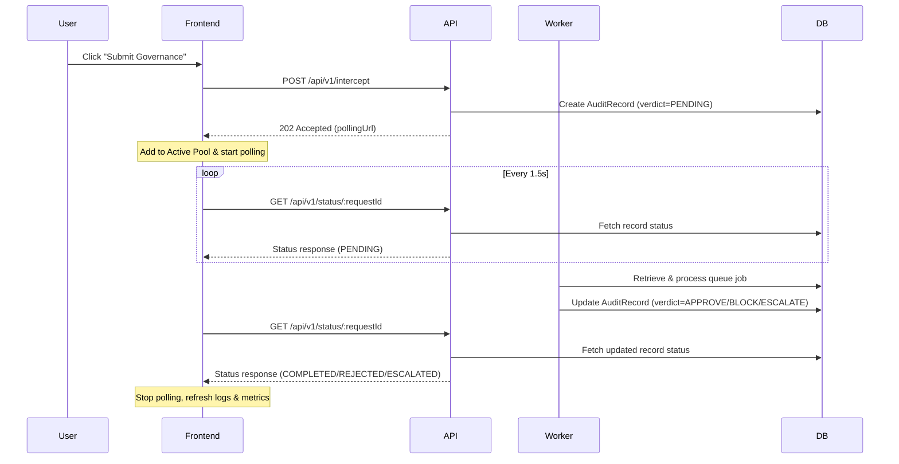

# Queue Transparency & Metrics Fix Technical Design

## 1. Flow & User Journeys
The system uses an asynchronous worker pattern to handle incoming compliance interception requests.
1. When a client simulator submits a request via `POST /api/v1/intercept`, the API saves an initial `PENDING` audit record and pushes the job to a Redis list queue.
2. The UI simulator client receives a `202 Accepted` status with a `pollingUrl` (`/api/v1/status/:requestId`).
3. The UI begins polling the `pollingUrl` every 1.5 seconds.
4. Concurrently, the background `JobWorkerService` pulls the job, evaluates policies, processes the PII via TCP, and updates the database record's decision verdict.
5. On the next poll, the UI detects the updated verdict (e.g., `APPROVED`, `REJECTED`, or `ESCALATED`) and displays the completed outcome, stopping the poll.



## 2. API Contract
No new API endpoints are introduced. Instead, existing endpoints are corrected and leveraged:
*   `GET /api/v1/metrics`: Updated to return database-backed counts.
    *   **Response Schema**:
        ```json
        {
          "totalRequests": 12,
          "requestCount": 12,
          "averageLatencyMs": 142.5,
          "p95LatencyMs": 210,
          "p99LatencyMs": 280,
          "errorRate": 0,
          "verdictDistribution": {
            "APPROVE": 8,
            "BLOCK": 3,
            "ESCALATE": 1
          }
        }
        ```
*   `GET /api/v1/status/:requestId`: Remains the same, but polled by the frontend.
*   `GET /api/v1/audit/records`: Fetches all logs, which contains `PENDING` records in real-time.

## 3. Data Model & State Machine
We query the existing `AuditRecord` Postgres schema:
- **Metrics Queries**:
  - `totalRequests`: `prisma.auditRecord.count()`
  - `verdictDistribution`: Group by or iterate over `decisionRecord -> verdict` values.
  - `averageLatency`: Calculate average difference between `completedAt` and `receivedAt` for non-pending records.

## 4. Error Handling & Edge Cases
*   **Divide-by-zero guard**: In the frontend, handle `metrics.requestCount === 0` to display `0%` block/escalation rates instead of rendering `NaN%`.
*   **Polling cleanup**: Ensure interval timers are cleared upon component unmounting, when the status is final, or if a poll error occurs.
