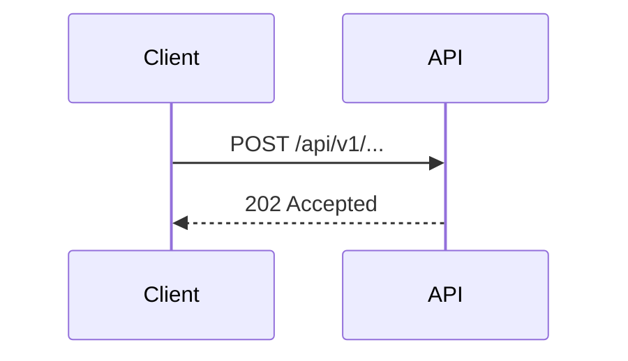

# Solution Design Template

## 1. Flow & User Journeys
*Describe the interactive and data flows. Use Mermaid sequencing where helpful.*



## 2. API Contract
*   **Endpoint**: `POST /api/v1/...`
*   **Headers**:
    *   `Content-Type: application/json`
*   **Request Schema (Zod)**:
    ```typescript
    const requestSchema = z.object({ ... });
    ```
*   **Response (202 Accepted)**:
    ```json
    { "requestId": "..." }
    ```

## 3. Data Model & State Machine
*Describe database schemas, types, and states.*

## 4. Error Handling & Edge Cases
*   **TCP Connection drops**: *Fallback mechanism.*
*   **Invalid Parameters**: *HTTP 400 with details.*

## 5. Non-Functional Budgets
*   **Performance**: Max 10ms overhead.
*   **Accessibility**: Color contrast WCAG AA.
*   **Security**: Inputs sanitized, logs redacted.
